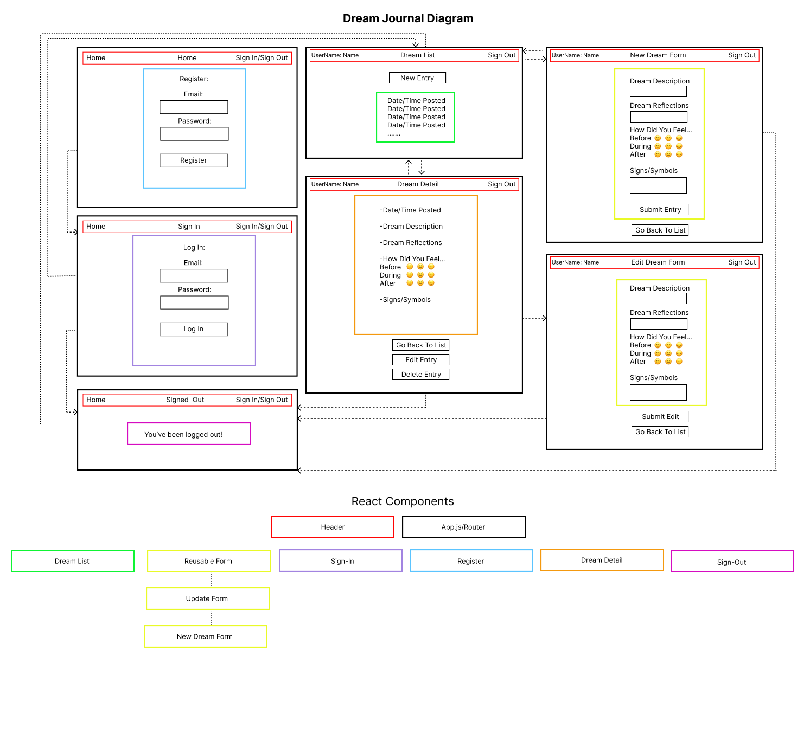

## React Component Diagram

## Bugs:
* login/logout only processes after refreshing the page
* When editing the dream, the timeStamp gets overridden
* The "How Did you Feel?" needs to be fleshed out
* background img is WIP

##Current Resources:
https://css-tricks.com/perfect-full-page-background-image/

https://stackoverflow.com/questions/39805537/how-to-apply-global-styles-with-css-modules-in-a-react-app

https://www.reddit.com/r/reactjs/comments/sf0sns/how_to_change_the_background_image_of_the_body/

https://upmostly.com/tutorials/react-background-image

https://stackoverflow.com/questions/42464888/how-do-i-change-the-background-color-of-the-body

https://codersblock.com/blog/creating-glow-effects-with-css/

https://getbootstrap.com/docs/4.0/components/buttons/

